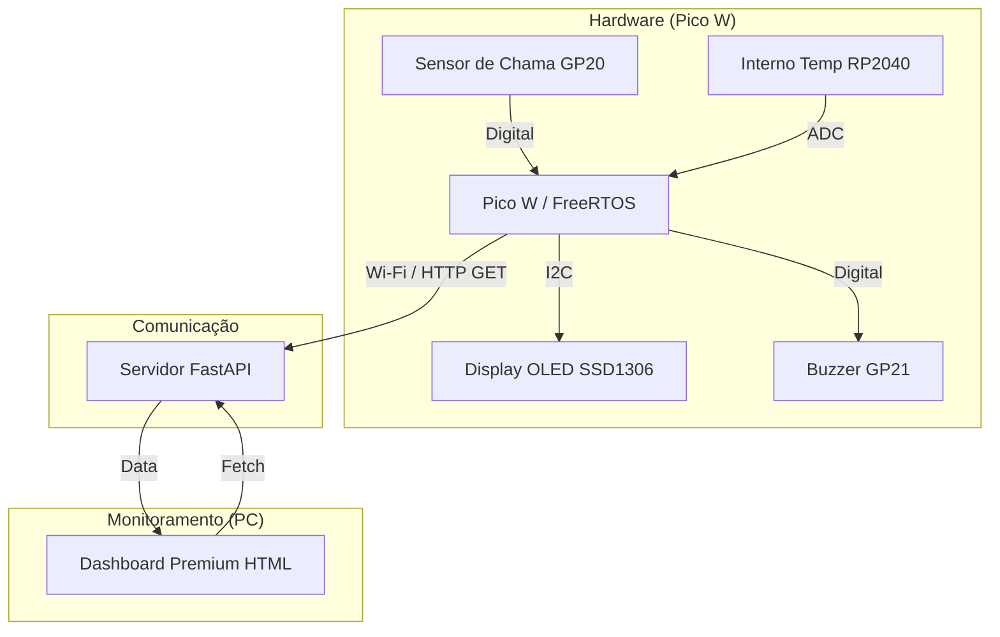

# 🔥 FireGuard Pro - IoT Fire Detection System

智能防火 (Smart Fire Protection) - Intelligent fire detection and monitoring system based on **Raspberry Pi Pico W** and **FreeRTOS**.


## 📊 Arquitetura do Sistema



## 🚀 Funcionalidades

- **Detecção de Chama**: Sensor infravermelho (KY-026) conectado ao GP20 com lógica de debounce para evitar falsos positivos.
- **Monitoramento de Temperatura**: Leitura em tempo real da temperatura interna do RP2040.
- **Alertas Locais**: 
  - **Buzzer**: Bips de alerta imediato ao detectar fogo.
  - **OLED (SSD1306)**: Interface visual mostrando o status "Sist: OK" ou "FOGO!!!".
- **Dashboard Web Premium**:
  - Interface moderna com **Glassmorphism** e **Dark Mode**.
  - Atualização automática via Wi-Fi a cada 5 segundos.
  - Alerta visual dinâmico (a tela pisca em vermelho em caso de incêndio).
- **Multitarefa Robusta**: Implementado com **FreeRTOS** para garantir que a rede não trave a detecção dos sensores.

## 🛠️ Hardware Necessário

- 1x Raspberry Pi Pico W (ou Placa EmbarcaTech)
- 1x Sensor de Chama (D0 no GP20)
- 1x Buzzer Ativo (GP21)
- 1x Display OLED I2C SSD1306 (SDA no GP14, SCL no GP15)
- 1x LED Externo (GP11)

## 📁 Estrutura do Projeto

```text
rp2040-freertos-template-main/
├── src/
│   ├── main.c              # Lógica principal (FreeRTOS Tasks)
│   └── CMakeLists.txt      # Configuração de build (Incluso hardware_adc)
├── include/                # Headers das bibliotecas
├── web_dashboard/          # Interface Web
│   ├── app.py              # Servidor Backend (FastAPI)
│   └── templates/
│       └── index.html      # Frontend Premium
└── README.md               # Este arquivo.
```

## ⚙️ Configuração e Instalação

### 1. Requisitos de Software
- **Pico SDK V2.2.0** instalado e configurado.
- **Python 3.9+** para rodar o Dashboard.
- Bibliotecas Python: `pip install fastapi uvicorn pydantic jinja2`

### 2. Configuração do Wi-Fi e IP
Edite o arquivo `src/main.c` com suas credenciais:
```c
#define WIFI_SSID "NOME_DO_WIFI"
#define WIFI_PASSWORD "SENHA_DO_WIFI"
#define SERVER_IP "IP_DO_SEU_PC" // Descubra usando 'ipconfig' no CMD
```

### 3. Compilação e Gravação
1. No VS Code, clique no botão **Build** (ícone de engrenagem ou barra inferior).
2. Conecte a Pico W em modo BOOTSEL.
3. Arraste o arquivo `rp2040-freertos-template.uf2` para a placa.

### 4. Iniciando o Dashboard
No terminal do seu PC, dentro da pasta do projeto:
```bash
python web_dashboard/app.py
```
Acesse no navegador: **`http://localhost:5000`**

## 🛡️ Solução de Problemas (FAQ)

- **Erro "Falha LwIP 5":** Indica Timeout. O Windows está bloqueando a conexão. Desative o **Firewall do Windows** ou crie uma regra de entrada para a porta 5000 (TCP).
- **Dados não atualizam no site:** Verifique se o `SERVER_IP` no `main.c` é exatamente o IP do seu PC na rede Wi-Fi.
- **Sensor sempre em "FOGO":** Ajuste o potenciômetro azul no módulo do sensor de chama até que o LED de sinal apague quando não houver fogo por perto.

---
*Desenvolvido para monitoramento crítico de ambientes utilizando tecnologia IoT de ponta.* 📡🚒
